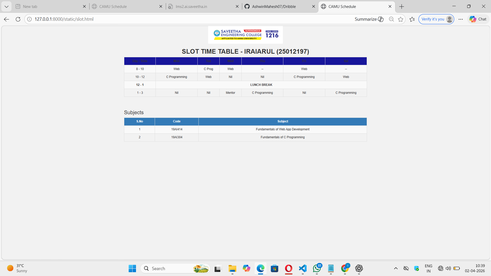
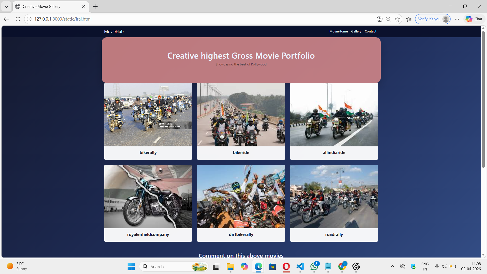
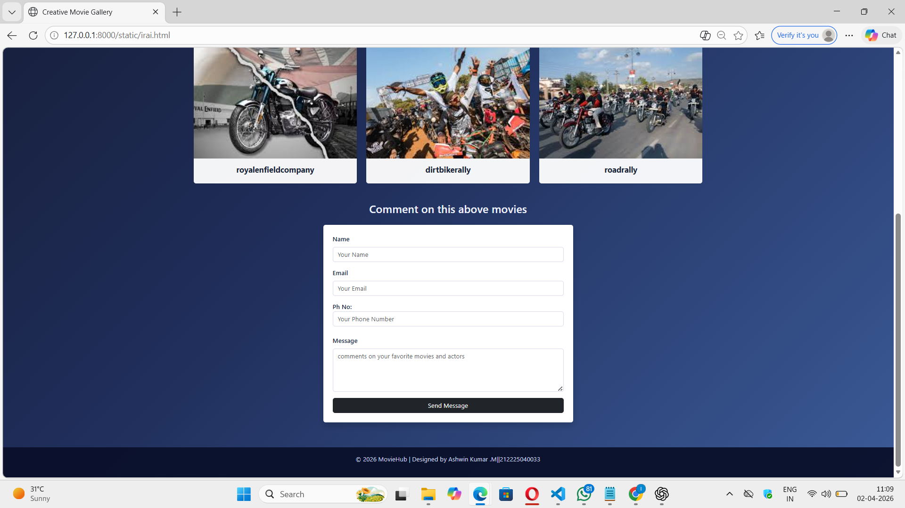

# Case Study: Dribble Clone
## Date:02-04-2026

## AIM:
To create a simplified clone of Dribbble (https://dribbble.com/) landing page.


## DESIGN STEPS:

### Step 1:
Clone the repository from GitHub.

### Step 2:
Create Django Admin project.

### Step 3:
Create a New App under the Django Admin project.

### Step 4:
Design a navigation bar with links: Inspiration, Find Work, Learn Design, Go Pro, Sign In, Sign Up.

### Step 5:
Add a catchy headline with a search bar.

### Step 6:
Use ```<div>``` containers for each dribbble shot thumbnail.

### Step 7:
Include designer name and likes count below each image.

### Step 8:
Include text like “Find your next design inspiration” with a button (“Join Dribbble” or “Explore”).

### Step 9:
Create a footer with your name and register number.

### Step 10:
Publish the website in the LocalHost.

## PROGRAM :
```
<!DOCTYPE html>
<html>
<head>
    <title>CAMU Schedule</title>

    <link rel="stylesheet" href="https://maxcdn.bootstrapcdn.com/bootstrap/3.4.1/css/bootstrap.min.css">

    <script src="https://ajax.googleapis.com/ajax/libs/jquery/3.7.1/jquery.min.js"></script>

    <script src="https://maxcdn.bootstrapcdn.com/bootstrap/3.4.1/js/bootstrap.min.js"></script>

    <style>
        body {
            background-color: #f2f2f2;
        }
        .table th, .table td {
            text-align: center;
        }
        .lunch {
            background-color: #dff0d8;
            font-weight: bold;
        }
        .header {
            background-color: rgb(24, 22, 155);
        }
    </style>
</head>

<body>

<div class="container">

    <div class="text-center">
        
    </div>

    <h2 class="text-center"><b>SLOT TIME TABLE - IRAIARUL (25012197)</b></h2>

    <!-- Responsive Table -->
    <div class="table-responsive">
        <table class="table table-bordered table-striped table-hover">

            <thead class="header">
                <tr>
                    <th>Day / Time</th>
                    <th>Mon</th>
                    <th>Tue</th>
                    <th>Wed</th>
                    <th>Thu</th>
                    <th>Fri</th>
                    <th>Sat</th>
                </tr>
            </thead>

            <tbody>
                <tr>
                    <td>8 - 10</td>
                    <td>Web</td>
                    <td>C Prog</td>
                    <td>Web</td>
                    <td>--</td>
                    <td>Web</td>
                    <td>--</td>
                </tr>

                <tr>
                    <td>10 - 12</td>
                    <td>C Programming</td>
                    <td>Web</td>
                    <td>Nil</td>
                    <td>Nil</td>
                    <td>C Programming</td>
                    <td>Web</td>
                </tr>

                <tr class="lunch">
                    <td>12 - 1</td>
                    <td colspan="6">LUNCH BREAK</td>
                </tr>

                <tr>
                    <td>1 - 3</td>
                    <td>Nil</td>
                    <td>Nil</td>
                    <td>Mentor</td>
                    <td>C Programming</td>
                    <td>Nil</td>
                    <td>C Programming</td>
                </tr>
            </tbody>

        </table>
    </div>

    <br>

    <h3>Subjects</h3>
    <table class="table table-bordered table-striped">
        <thead class="bg-primary">
            <tr>
                <th>S.No</th>
                <th>Code</th>
                <th>Subject</th>
            </tr>
        </thead>

        <tbody>
            <tr>
                <td>1</td>
                <td>19AI414</td>
                <td>Fundamentals of Web App Development</td>
            </tr>

            <tr>
                <td>2</td>
                <td>19AI304</td>
                <td>Fundamentals of C Programming</td>
            </tr>
        </tbody>
    </table>

</div>

</body>
</html>
```

## OUTPUT:


## RESULT:
The project for responsive web design in creating a clone of dribble.com is completed successfully.
